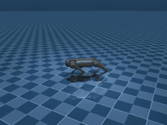
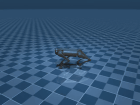
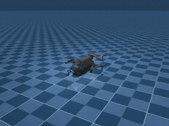
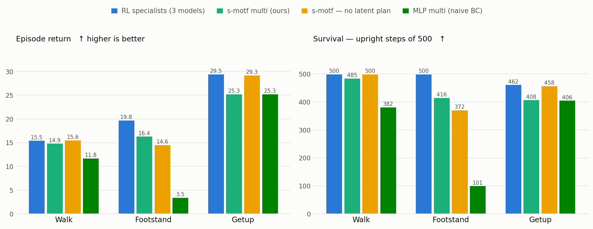

# s-motf — State-Mixture-of-Transformers (L-WAM)

A **Latent World-Action Model** for legged locomotion that fuses three current
ideas from robotic foundation models into a single, single-GPU-friendly network:

1. **Multi-modal state tokenization** — proprioceptive state split into physical
   sub-vectors, each embedded as its own token.
2. **Mixture-of-Transformers (MoT)** — modality-specific LayerNorm / QKV / FFN
   weights with a *shared* attention operation, so high-frequency leg dynamics
   don't smear the abstract task/balance representation.
3. **Flow-matching action head** — a fast 3-step ODE integrator that turns
   Gaussian noise into joint targets, conditioned on the state context.
4. **Prior/posterior latent-plan alignment** — a Play-LMP-style scheme that
   trains a deployable "prior" planner to match a future-aware "posterior"
   planner that is discarded at deployment.

The whole model is intentionally tiny (`d = 256`, a handful of tokens and
blocks) so it trains and runs on a single T4 (Colab) in real time.

> **Naming note.** "State-Space" here means *physical state-space tokenization*
> (embedding the robot's state vector), **not** a structured state-space model
> (S4/Mamba). There is no SSM block in this architecture.

---

## Demo — one model, three skills

<table>
  <tr>
    <th align="center">Walk</th>
    <th align="center">Footstand</th>
    <th align="center">Getup</th>
  </tr>
  <tr>
    <td></td>
    <td></td>
    <td></td>
  </tr>
</table>

A **single** s-motf — one set of weights — switched between skills by the command
vector. Proprioception only, closed loop at 50 Hz, 3-step flow sampling.

---

## Results — Unitree Go1 (MuJoCo Playground)

<picture>
  <source media="(prefers-color-scheme: dark)" srcset="assets/results-dark.png">
  
</picture>

One command-conditioned s-motf is behavior-cloned from **three** PPO specialists
(`Go1JoystickFlatTerrain`, `Go1Footstand`, `Go1Getup`) on pooled, skill-tagged
data. Evaluated in each skill's own environment — 10 episodes × 500 steps.
Cells are **episode return / upright steps**.

| Policy | Models | Walk | Footstand | Getup |
|---|:--:|---|---|---|
| RL specialists *(BC ceiling)* | 3 | 15.5 / 500 | 19.8 / 500 | 29.5 / 462 |
| **s-motf multi (ours)** | **1** | **14.9 / 485** | **16.4 / 416** | **25.3 / 408** |
| s-motf — no latent plan | 1 | 15.6 / 500 | 14.6 / 372 | 29.3 / 458 |
| MLP multi *(naive BC)* | 1 | 11.8 / 382 | **3.5 / 101** | 25.3 / 406 |

**One model ≈ three specialists.** s-motf retains **96% / 83% / 86%** of each
specialist's return while replacing three separate policies with one set of weights.

**The naive generalist collapses.** Given identical data and capacity, the MLP fails
on **footstand** — the skill least like walking — at **4.7× lower return (3.5 vs 16.4)**
and **4.1× shorter survival (101 vs 416)**. MSE regression averages conflicting
skills into an invalid "mean" action; the flow-matching head commits to one mode.
On **walk** s-motf also leads (+26% return). On **getup** the two tie — the win
appears exactly where multimodality bites, not everywhere.

<details>
<summary><b>Ablations &amp; the single-skill baseline (reported honestly)</b></summary>

**Latent plan — why removing it *helps* on two of three skills.**

The plan is trained with the **posterior** (which sees the future) but deployed with the
**prior** (which only guesses it). That gap is a cost paid on *every* task: an imperfect
`z_prior` injects approximation error into the action token, and the head — trained on
posterior-quality plans — no longer receives them at deploy. The *benefit* only appears
when the current state is **ambiguous**, i.e. proprioception alone doesn't determine what
to do next and an intent vector disambiguates it.

- **Walk** and **getup** are largely **reactive**: state + command already determine the
  action (one gait; one recovery trajectory from a given fallen pose). The plan adds no
  information, so only its prior-approximation error remains → removing it *helps*
  (15.6/500 and 29.3/458 — essentially matching the specialists).
- **Footstand** is an **unstable balance** task: the same proprioceptive state can precede
  different corrections depending on phase and intent, so temporal consistency matters.
  Here the plan pays for itself → keeping it *helps* (16.4/416 vs 14.6/372).

The plan is therefore a **conditional** win: it buys disambiguation, and you only profit
where the task is ambiguous. Note also that **even without the plan, s-motf beats the MLP
on footstand (14.6 vs 3.5)** — so the **MoT + flow-matching head**, not the plan, is what
prevents the collapse.

**Single-skill, flat walking** (earlier experiment, 20 episodes × 800 steps):

| Policy | Return ↑ | Survival ↑ | Track err ↓ |
|---|---:|---:|---:|
| RL teacher *(ceiling)* | 24.9 ± 2.6 | 787 / 800 | 0.083 |
| s-motf | 23.8 ± 6.0 | 748 / 800 | 0.122 |
| − world model (`L_dyn=0`) | 25.1 ± 2.7 | 786 / 800 | 0.091 |
| − latent plan | 23.5 ± 5.4 | 744 / 800 | 0.102 |
| MLP baseline | 17.7 ± 11.2 | 576 / 800 | 0.189 |

On a *unimodal* task the world model and latent plan add nothing (the `L_dyn`
auxiliary slightly competes with the cloning objective). s-motf still beats naive BC
on long-horizon robustness (748 vs 576 survival). **BC's ceiling is its teacher** —
s-motf never exceeds a specialist, and is not claimed to.
</details>

---

## Quickstart

Two environments — the RL teacher (JAX/Brax) and the student (PyTorch) don't share a stack:

```bash
# student: s-motf itself (this is the whole dependency list)
pip install torch pyyaml

# teacher + simulation: MuJoCo Playground envs
pip install "jax[cuda12]" mujoco mujoco-mjx brax playground
```

**Sanity check first — no simulator required.** s-motf trains on a synthetic,
provably-learnable dataset before touching MuJoCo, so if the losses don't collapse the
bug is in the model, not the data:

```bash
python -m smotf.train            # overfit one batch -> "OVERFIT PASS ✅"
```

**Full pipeline** — RL teachers → recorded demonstrations → one behavior-cloned student:

```bash
# 1. train an RL teacher per skill (PPO on MuJoCo Playground)
python train_go1.py Go1JoystickFlatTerrain go1_policy.pkl
python train_go1.py Go1Footstand           footstand_policy.pkl
python train_go1.py Go1Getup               getup_policy.pkl 300000000   # getup needs more steps

# 2. record skill-tagged demonstrations, pool them
python collect_multiskill.py Go1JoystickFlatTerrain go1_policy.pkl       0 go1_walk.npz
python collect_multiskill.py Go1Footstand           footstand_policy.pkl 1 go1_footstand.npz
python collect_multiskill.py Go1Getup               getup_policy.pkl     2 go1_getup.npz
python combine_skills.py go1_walk.npz go1_footstand.npz go1_getup.npz

# 3. behavior-clone ONE s-motf on all three skills
python -m smotf.train multi                    # -> checkpoint_multi.pt

# 4. evaluate per skill, and render a rollout
python eval_multiskill.py
python rollout_multiskill.py Go1Footstand 1 rollout_footstand.npz
python save_media.py rollout_footstand.npz footstand     # -> footstand.gif
```

Baselines: `python mlp_baseline.py go1_multiskill.npz configs/multiskill.yaml` (naive BC),
`python -m smotf.train multi_noplan` (latent-plan ablation).

---

## 0. Task overview

`s-motf` runs a **50 Hz** closed-loop controller (20 ms loop) for a **12-DoF
quadruped** (e.g. Unitree Go1/Go2) walking on flat ground. Each loop:

- A high-level command sets desired body velocity.
- The model observes proprioceptive state.
- The flow-matching head emits 12 joint **target angles**.
- A 1 kHz decentralized PD controller tracks those targets into torques.

### Command
$$\mathbf{c}_t = \begin{bmatrix} v_x^{\text{target}} & v_y^{\text{target}} & \omega_z^{\text{target}} \end{bmatrix}^\top \in \mathbb{R}^3$$

### State (proprioceptive only)
| Sub-vector | Dim | Contents |
|---|---|---|
| $\mathbf{s}_{\text{base}}$ | 12 | RPY $\boldsymbol{\phi}\,(3)$, ang-vel $\boldsymbol{\omega}\,(3)$, lin-vel $\mathbf{v}\,(3)$, projected gravity $\mathbf{g}\,(3)$ |
| $\mathbf{s}_{\text{legs}}$ | 24 | joint angles $\mathbf{q}\,(12)$, joint velocities $\dot{\mathbf{q}}\,(12)$ |
| $\mathbf{s}_{\text{contacts}}$ | 4 | foot contacts $c_{\text{FL}},c_{\text{FR}},c_{\text{RL}},c_{\text{RR}}$ |

### Action
$$\mathbf{a}_t = \begin{bmatrix} q_1^{\text{target}} & \dots & q_{12}^{\text{target}} \end{bmatrix}^\top \in \mathbb{R}^{12}$$

Tracked by a PD law at 1 kHz:

$$\boldsymbol{\tau}_t = \mathbf{K}_p(\mathbf{a}_t - \mathbf{q}_t) + \mathbf{K}_d(\mathbf{0} - \dot{\mathbf{q}}_t)$$

---

## 1. Tokenization

Each modality is mapped by a dedicated single linear layer (with bias) into the
shared hidden width `d = 256`:

$$\mathbf{h}_i = \mathbf{W}_i \mathbf{s}_i + \mathbf{b}_i \in \mathbb{R}^{256}$$

for $i \in \{\text{base}, \text{legs}, \text{contacts}, \text{command}, \text{action}\}$,
stacked into a sequence:

$$\mathbf{H} = \big[\mathbf{h}_{\text{base}};\ \mathbf{h}_{\text{legs}};\ \mathbf{h}_{\text{contacts}};\ \mathbf{h}_{\text{command}};\ \mathbf{h}_{\text{action}}\big] \in \mathbb{R}^{5 \times 256}$$

The **action token** additionally receives a **flow-time embedding**
$\tau(t)$ (sinusoidal → MLP) so the network knows where it is on the ODE
trajectory:

$$\mathbf{h}_{\text{action}} \leftarrow \mathbf{W}_{\text{action}}\mathbf{a}_t^{(\text{noisy})} + \mathbf{b}_{\text{action}} + \tau(t)$$

---

## 2. Mixture-of-Transformers block

Every modality keeps its **own** LayerNorm, QKV projection, and FFN expert.
Only the **attention** is shared, so tokens can cross-talk while preserving
per-modality magnitude/semantics. A block is repeated $L$ times.

**Per-token, pre-attention (decoupled):**

$$\mathbf{h}_i' = \text{LayerNorm}_i(\mathbf{h}_i), \qquad \mathbf{Q}_i = \mathbf{W}_Q^i \mathbf{h}_i', \quad \mathbf{K}_i = \mathbf{W}_K^i \mathbf{h}_i', \quad \mathbf{V}_i = \mathbf{W}_V^i \mathbf{h}_i'$$

All **5** tokens are projected.

**Shared attention** over the stacked sequence:

$$\mathbf{Z} = \text{Softmax}\left(\frac{\mathbf{Q}\,\mathbf{K}^\top}{\sqrt{d}}\right)\mathbf{V} \in \mathbb{R}^{5 \times 256}$$

**Decoupled FFN experts** (residual), each token routed to its own MLP:

$$\mathbf{h}_i \leftarrow \mathbf{h}_i + \text{FFN}_i(\mathbf{Z}[i])$$

**Heads** read the final block:

$$\hat{\mathbf{s}}_{t+1} = \text{Head}_{\text{dyn}}(\mathbf{z}_{\text{base}}) \in \mathbb{R}^{12}, \qquad \mathbf{v}_\theta = \text{Head}_{\text{act}}(\mathbf{z}_{\text{action}}) \in \mathbb{R}^{12}$$

---

## 3. Flow-matching action head (3-step)

We use **rectified-flow** convention: a straight path from noise to data.

- $\mathbf{a}^{(0)} \sim \mathcal{N}(\mathbf{0}, \mathbf{I})$ at $t = 0$ (noise)
- clean target $\mathbf{a}^{(1)} = \mathbf{a}_{\text{clean}}$ at $t = 1$ (data)
- interpolation $`\mathbf{a}_t {=} (1-t)\mathbf{a}^{(0)} + t\mathbf{a}_{\text{clean}}`$
- **target velocity** $\mathbf{u} = \mathbf{a}_{\text{clean}} - \mathbf{a}^{(0)}$ (constant along the path)

**Training** regresses the field to that target (see §5).

**Sampling** (3 Euler steps, $dt = \tfrac{1}{3}$), integrating **forward** from
noise at $t = 0$ to the joint targets at $t = 1$:

$$\mathbf{a} \leftarrow \mathbf{a} + dt \cdot \mathbf{v}_\theta(\mathbf{a}, t, \mathbf{C}),\quad t \in \{0,\ \tfrac{1}{3},\ \tfrac{2}{3}\}$$

```
a(0)  --+dt·v-->  a(1/3)  --+dt·v-->  a(2/3)  --+dt·v-->  q_target
noise, t=0                                                 data, t=1
```

The 3 steps are ODE **integration** steps that denoise a single action — not a
temporal horizon. Action-chunking (predict $H \times 12$, execute the first) is
an optional extension.

Context for every step:

$$\mathbf{C} = \{\mathbf{s}_{\text{base}}, \mathbf{s}_{\text{legs}}, \mathbf{s}_{\text{contacts}}, \mathbf{c}_t, \mathbf{z}_{\text{plan}}\}$$

---

## 4. Prior / posterior latent plan (Play-LMP style)

A latent plan $\mathbf{z}_{\text{plan}}$ conditions the action head.

- **Posterior** (training only): encodes the *future* trajectory the robot
  actually executed → physically-grounded goal vector. Encoder is **swappable**;
  default is a small GRU/MLP over future **proprioceptive** states
  $\mathbf{s}_{t+1:t+H}$. (A frozen visual encoder such as V-JEPA only applies if
  you add camera observations to the state — this task is proprioceptive, so the
  default is proprioceptive.)
- **Prior** (deployment): guesses $\mathbf{z}_{\text{plan}}$ from current state +
  command only. At deployment the posterior is discarded.

```
TRAIN:   context  → prior      → z_prior      ─┐
         future   → posterior  → z_posterior  ─┴→ L_align
DEPLOY:  context  → prior      → z_prior      → flow-matching action head
```

Default alignment is **MSE with stop-gradient** on a deterministic latent (a
VAE/KL variant is an option):

$$\mathcal{L}_{\text{align}} = \big\| \mathbf{z}_{\text{prior}} - \text{sg}(\mathbf{z}_{\text{posterior}}) \big\|^2$$

---

## 5. Training objective

$$\mathcal{L}_{\text{total}} = \lambda_{\text{FM}}\,\mathcal{L}_{\text{FM}} + \lambda_{\text{dyn}}\,\mathcal{L}_{\text{dyn}} + \lambda_{\text{align}}\,\mathcal{L}_{\text{align}}$$

**Flow matching** (single random $t\sim\mathcal{U}(0,1)$ per sample):

$$\mathcal{L}_{\text{FM}} = \mathbb{E}_{t,\,\mathbf{a}^{(0)},\,\mathbf{a}_{\text{clean}}} \big\| \mathbf{v}_\theta(\mathbf{a}_t, t, \mathbf{C}) - (\mathbf{a}_{\text{clean}} - \mathbf{a}^{(0)}) \big\|^2$$

**World dynamics** (next-state prediction from the base expert):

$$\mathcal{L}_{\text{dyn}} = \big\| \hat{\mathbf{s}}_{t+1} - \mathbf{s}_{t+1}^{\text{actual}} \big\|^2$$

**Latent alignment** (as above):

$$\mathcal{L}_{\text{align}} = \big\| \mathbf{z}_{\text{prior}} - \text{sg}(\mathbf{z}_{\text{posterior}}) \big\|^2$$

Suggested starting weights: $\lambda_{\text{FM}} = 1.0,\ \lambda_{\text{dyn}} = 0.5,\ \lambda_{\text{align}} = 0.1$.

---

## 6. World model + planning

Behavior cloning caps s-motf at the teacher (the multi-skill result above is
83–96% of the specialists, and cannot exceed them). This extension adds a
**closed, rollable world model** so the policy can *plan* instead of only react —
a path toward surpassing the teacher by optimizing predicted reward rather than
imitating.

> **What works:** a closed world model that imagines real, contact-rich Go1
> dynamics to ~1–2% error over 5 steps (the usual failure case for learned models),
> plus a staged deploy-time ablation that localized and fixed a reward-ranking bug.
> **Where it stands:** on the nominal task BC already equals the reward-optimal
> teacher (no headroom to beat), and under perturbation planning is **on par with
> BC — never worse, and slightly ahead in point estimate** (a larger-N test is
> needed to confirm a real robustness gain). Full numbers below.

**Why the Phase-1 dynamics head was not a world model.** `DynamicsHead` maps a
256-d token → a 12-d *base* state. Its output type ≠ its input, so it can never be
fed back in, never rolled forward, and is unused at deploy — an auxiliary loss, not
a simulator.

**The fix — a closed model in raw state space** (no latent needed; proprioception
is only 40-d):

$$\mathbf{s} = [\mathbf{s}_{\text{base}}, \mathbf{s}_{\text{legs}}, \mathbf{s}_{\text{contacts}}] \in \mathbb{R}^{40}, \qquad f_\phi(\mathbf{s}, \mathbf{a}) = \mathbf{s} + \Delta_\phi(\mathbf{s}, \mathbf{a}) \in \mathbb{R}^{40}, \qquad r_\psi(\mathbf{s}, \mathbf{a}, \mathbf{c}) \in \mathbb{R}$$

The reward is **command-conditioned** ($\mathbf{c}$): tracking reward depends on the
commanded velocity (not in the state) and the skills have different reward functions,
so $r(\mathbf{s},\mathbf{a})$ alone cannot rank candidate actions. Dynamics $f$ stay
command-free — physical transitions don't depend on the requested skill.

`f` outputs a **state-sized delta** (predicting the small change is far more stable
than the absolute next state), so `s'` is a valid next input → the model is
**chainable**. It is trained on its **own** K-step rollout (feeding predictions back
in), which is what makes multi-step imagination stable:

$$\mathcal{L}_{\text{world}} = \sum_{k=1}^{K} \big\| f_\phi^{(k)}(\mathbf{s}_t, \mathbf{a}_{t:t+k}) - \mathbf{s}_{t+k} \big\|^2 + \big\| r_\psi(\mathbf{s}_{t+k-1}, \mathbf{a}_{t+k-1}) - r_{t+k} \big\|^2$$

**Planning (deploy) — the flow head proposes, the world model disposes.** MPC over
the *generative* policy:

```
observe → sample N candidate actions from the flow head (its noise → N diverse actions)
        → roll each through f for H steps, score with r
        → execute the best candidate's first action → replan
```

The generative action head is essential here: an MLP is deterministic (one action,
nothing to search), while sampling the flow head N times yields N distinct
proposals.

### Findings

**1. The world model imagines accurately.** Trained on its own K-step rollout, the
5-step imagination error stays bounded on real Go1 dynamics — contact-rich legged
dynamics, which usually diverge:

| horizon | 1 step | 2 | 3 | 4 | 5 |
|---|---|---|---|---|---|
| mean abs err (normalized) | 0.010 | 0.011 | 0.014 | 0.017 | 0.019 |

**2. A ranking bug was found and fixed (the reason for the reward-conditioning
above).** A staged deploy-time ablation localized it — with a task-ambiguous
$r(\mathbf{s},\mathbf{a})$, *reward ranking alone* was **worse than random** (argmax
selected over-estimated candidates); command-conditioning restored it:

| planner config (walk, matched seeds) | `r(s,a)` | `r(s,a,c)` |
|---|---:|---:|
| N=1, H=1 *(= BC, plumbing check)* | 5.9 | 5.9 |
| **N=16, H=1** *(reward ranking only)* | **4.2** ❌ | **5.9** ✅ |
| N=16, H=3 *(ranking + rollout)* | 5.9 | 5.9 |

**3. Planning is on par with BC under perturbation — never worse, slightly ahead.**
With the ranker fixed, planning matches BC on the nominal task (as expected — see
below). Under strong random pushes (velocity kicks that drop BC's survival to
~206/300), the planner's point estimate is **higher on both metrics**, though within
the run-to-run noise at 20 episodes:

| walk, 20 episodes, with pushes | return | survival / 300 |
|---|---:|---:|
| s-motf (BC) | 4.94 ± 2.73 | 205.7 ± 96.3 |
| **s-motf + planning (N=16, H=3)** | **5.04 ± 2.77** | **208.3 ± 99.0** |

**Reading it honestly.** On the *nominal* task there is simply no headroom: BC
already equals the reward-optimal specialist, so the best of N flow proposals is
BC's own action and search re-selects it. Under *perturbation* — where cloned
reflexes are weakest — planning edges ahead, which is the expected direction, but
the margin is inside the noise, so it is **not yet a confirmed gain**. Two concrete,
promising follow-ups: (a) **more episodes** (50–100) to resolve the sub-std edge;
(b) the world model was trained on **push-free** data, so under pushes it imagines
out-of-distribution — retraining it **with** perturbations should sharpen recovery
imagination exactly where it matters. Either could turn "on par, trending up" into a
measured robustness win.

**The standing contribution** is a *closed, accurate, command-conditioned* world
model for a contact-rich legged system, plus a rigorous localization of where
model-based planning helps a teacher-parity BC policy — with a clear, testable path
to a robustness gain.

This is also the ablation with teeth — remove the world model and the
planner falls back to plain `act()` (BC).
