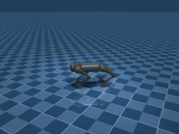

# s-motf — State-Mixture-of-Transformers (L-WAM)

A **Latent World-Action Model** for legged locomotion that fuses three current
ideas from robotic foundation models into a single, single-GPU-friendly network:

1. **Multi-modal state tokenization** — proprioceptive state split into physical
   sub-vectors, each embedded as its own token.
2. **Mixture-of-Transformers (MoT)** — modality-specific LayerNorm / QKV / FFN
   weights with a *shared* attention operation, so high-frequency leg dynamics
   don't smear the abstract task/balance representation.
3. **Flow-matching action head** — a fast 3-step ODE integrator that turns
   Gaussian noise into joint targets, conditioned on the state context.
4. **Prior/posterior latent-plan alignment** — a Play-LMP-style scheme that
   trains a deployable "prior" planner to match a future-aware "posterior"
   planner that is discarded at deployment.

The whole model is intentionally tiny (`d = 256`, a handful of tokens and
blocks) so it trains and runs on a single T4 (Colab) in real time.

> **Naming note.** "State-Space" here means *physical state-space tokenization*
> (embedding the robot's state vector), **not** a structured state-space model
> (S4/Mamba). There is no SSM block in this architecture.

---

## Demo



s-motf behavior-cloned from an RL teacher, deployed in MuJoCo (prior-only, 3-step
flow sampling). Forward-velocity command, closed loop at 50 Hz.

## Results — Unitree Go1, flat terrain

Behavior cloning of a PPO teacher (MuJoCo Playground `Go1JoystickFlatTerrain`),
evaluated over 20 episodes of 800 steps in the same environment. Metrics: episode
return (env reward), survival (upright steps / 800), and command-tracking error.

| Policy | Method | Return ↑ | Survival ↑ | Track err ↓ |
|---|---|---:|---:|---:|
| RL teacher | PPO *(BC ceiling)* | 24.9 ± 2.6 | 787 / 800 | 0.083 |
| **s-motf (ours)** | MoT + flow-matching BC | **23.8 ± 6.0** | **748 / 800** | 0.122 |
| MLP baseline | naive state→action BC | 17.7 ± 11.2 | 576 / 800 | 0.189 |

**Takeaways.** s-motf **clones the RL expert to ~96% of its return** (23.8 vs 24.9),
and is **substantially more robust than naive MLP behavior cloning** over long
horizons — **+172 survival steps (748 vs 576), ~2× lower variance, and lower
tracking error**. The MLP accumulates error and falls; the generative flow policy
stays on-distribution.

<details>
<summary>Ablations (honest)</summary>

| Variant | Return | Survival |
|---|---:|---:|
| s-motf (full) | 23.8 ± 6.0 | 748 |
| − world model (`L_dyn=0`) | 25.1 ± 2.7 | 786 |
| − latent plan (`z_plan` off) | 23.5 ± 5.4 | 744 |

On *flat walking* the world model and latent plan do **not** improve BC — the task
is unimodal and reactive, so they add no signal (the `L_dyn` auxiliary slightly
competes with the cloning objective). Their value is expected to appear on
**multi-skill / multimodal** tasks, where a single generative model must hold
several conflicting behaviors — see the multi-skill experiment in the plan.
</details>

> Reproduce: `python -m smotf.train real` (train) then `python eval_go1.py` (table).

---

## 0. Task overview

`s-motf` runs a **50 Hz** closed-loop controller (20 ms loop) for a **12-DoF
quadruped** (e.g. Unitree Go1/Go2) walking on flat ground. Each loop:

- A high-level command sets desired body velocity.
- The model observes proprioceptive state.
- The flow-matching head emits 12 joint **target angles**.
- A 1 kHz decentralized PD controller tracks those targets into torques.

### Command
$$\mathbf{c}_t = \begin{bmatrix} v_x^{\text{target}} & v_y^{\text{target}} & \omega_z^{\text{target}} \end{bmatrix}^\top \in \mathbb{R}^3$$

### State (proprioceptive only)
| Sub-vector | Dim | Contents |
|---|---|---|
| $\mathbf{s}_{\text{base}}$ | 12 | RPY $\boldsymbol{\phi}\,(3)$, ang-vel $\boldsymbol{\omega}\,(3)$, lin-vel $\mathbf{v}\,(3)$, projected gravity $\mathbf{g}\,(3)$ |
| $\mathbf{s}_{\text{legs}}$ | 24 | joint angles $\mathbf{q}\,(12)$, joint velocities $\dot{\mathbf{q}}\,(12)$ |
| $\mathbf{s}_{\text{contacts}}$ | 4 | foot contacts $c_{\text{FL}},c_{\text{FR}},c_{\text{RL}},c_{\text{RR}}$ |

### Action
$$\mathbf{a}_t = \begin{bmatrix} q_1^{\text{target}} & \dots & q_{12}^{\text{target}} \end{bmatrix}^\top \in \mathbb{R}^{12}$$

Tracked by a PD law at 1 kHz:

$$\boldsymbol{\tau}_t = \mathbf{K}_p(\mathbf{a}_t - \mathbf{q}_t) + \mathbf{K}_d(\mathbf{0} - \dot{\mathbf{q}}_t)$$

---

## 1. Tokenization

Each modality is mapped by a dedicated single linear layer (with bias) into the
shared hidden width `d = 256`:

$$\mathbf{h}_i = \mathbf{W}_i \mathbf{s}_i + \mathbf{b}_i \in \mathbb{R}^{256}$$

for $i \in \{\text{base}, \text{legs}, \text{contacts}, \text{command}, \text{action}\}$,
stacked into a sequence:

$$\mathbf{H} = \big[\mathbf{h}_{\text{base}};\ \mathbf{h}_{\text{legs}};\ \mathbf{h}_{\text{contacts}};\ \mathbf{h}_{\text{command}};\ \mathbf{h}_{\text{action}}\big] \in \mathbb{R}^{5 \times 256}$$

The **action token** additionally receives a **flow-time embedding**
$\tau(t)$ (sinusoidal → MLP) so the network knows where it is on the ODE
trajectory:

$$\mathbf{h}_{\text{action}} \leftarrow \mathbf{W}_{\text{action}}\mathbf{a}_t^{(\text{noisy})} + \mathbf{b}_{\text{action}} + \tau(t)$$

---

## 2. Mixture-of-Transformers block

Every modality keeps its **own** LayerNorm, QKV projection, and FFN expert.
Only the **attention** is shared, so tokens can cross-talk while preserving
per-modality magnitude/semantics. A block is repeated $L$ times.

**Per-token, pre-attention (decoupled):**

$$\mathbf{h}_i' = \text{LayerNorm}_i(\mathbf{h}_i), \qquad \mathbf{Q}_i = \mathbf{W}_Q^i \mathbf{h}_i', \quad \mathbf{K}_i = \mathbf{W}_K^i \mathbf{h}_i', \quad \mathbf{V}_i = \mathbf{W}_V^i \mathbf{h}_i'$$

All **5** tokens are projected.

**Shared attention** over the stacked sequence:

$$\mathbf{Z} = \text{Softmax}\left(\frac{\mathbf{Q}\,\mathbf{K}^\top}{\sqrt{d}}\right)\mathbf{V} \in \mathbb{R}^{5 \times 256}$$

**Decoupled FFN experts** (residual), each token routed to its own MLP:

$$\mathbf{h}_i \leftarrow \mathbf{h}_i + \text{FFN}_i(\mathbf{Z}[i])$$

**Heads** read the final block:

$$\hat{\mathbf{s}}_{t+1} = \text{Head}_{\text{dyn}}(\mathbf{z}_{\text{base}}) \in \mathbb{R}^{12}, \qquad \mathbf{v}_\theta = \text{Head}_{\text{act}}(\mathbf{z}_{\text{action}}) \in \mathbb{R}^{12}$$

---

## 3. Flow-matching action head (3-step)

We use **rectified-flow** convention: a straight path from noise to data.

- $\mathbf{a}^{(0)} \sim \mathcal{N}(\mathbf{0}, \mathbf{I})$ at $t = 0$ (noise)
- clean target $\mathbf{a}^{(1)} = \mathbf{a}_{\text{clean}}$ at $t = 1$ (data)
- interpolation $`\mathbf{a}_t {=} (1-t)\mathbf{a}^{(0)} + t\mathbf{a}_{\text{clean}}`$
- **target velocity** $\mathbf{u} = \mathbf{a}_{\text{clean}} - \mathbf{a}^{(0)}$ (constant along the path)

**Training** regresses the field to that target (see §5).

**Sampling** (3 Euler steps, $dt = \tfrac{1}{3}$), integrating **forward** from
noise at $t = 0$ to the joint targets at $t = 1$:

$$\mathbf{a} \leftarrow \mathbf{a} + dt \cdot \mathbf{v}_\theta(\mathbf{a}, t, \mathbf{C}),\quad t \in \{0,\ \tfrac{1}{3},\ \tfrac{2}{3}\}$$

```
a(0)  --+dt·v-->  a(1/3)  --+dt·v-->  a(2/3)  --+dt·v-->  q_target
noise, t=0                                                 data, t=1
```

The 3 steps are ODE **integration** steps that denoise a single action — not a
temporal horizon. Action-chunking (predict $H \times 12$, execute the first) is
an optional extension.

Context for every step:

$$\mathbf{C} = \{\mathbf{s}_{\text{base}}, \mathbf{s}_{\text{legs}}, \mathbf{s}_{\text{contacts}}, \mathbf{c}_t, \mathbf{z}_{\text{plan}}\}$$

---

## 4. Prior / posterior latent plan (Play-LMP style)

A latent plan $\mathbf{z}_{\text{plan}}$ conditions the action head.

- **Posterior** (training only): encodes the *future* trajectory the robot
  actually executed → physically-grounded goal vector. Encoder is **swappable**;
  default is a small GRU/MLP over future **proprioceptive** states
  $\mathbf{s}_{t+1:t+H}$. (A frozen visual encoder such as V-JEPA only applies if
  you add camera observations to the state — this task is proprioceptive, so the
  default is proprioceptive.)
- **Prior** (deployment): guesses $\mathbf{z}_{\text{plan}}$ from current state +
  command only. At deployment the posterior is discarded.

```
TRAIN:   context  → prior      → z_prior      ─┐
         future   → posterior  → z_posterior  ─┴→ L_align
DEPLOY:  context  → prior      → z_prior      → flow-matching action head
```

Default alignment is **MSE with stop-gradient** on a deterministic latent (a
VAE/KL variant is an option):

$$\mathcal{L}_{\text{align}} = \big\| \mathbf{z}_{\text{prior}} - \text{sg}(\mathbf{z}_{\text{posterior}}) \big\|^2$$

---

## 5. Training objective

$$\mathcal{L}_{\text{total}} = \lambda_{\text{FM}}\,\mathcal{L}_{\text{FM}} + \lambda_{\text{dyn}}\,\mathcal{L}_{\text{dyn}} + \lambda_{\text{align}}\,\mathcal{L}_{\text{align}}$$

**Flow matching** (single random $t\sim\mathcal{U}(0,1)$ per sample):

$$\mathcal{L}_{\text{FM}} = \mathbb{E}_{t,\,\mathbf{a}^{(0)},\,\mathbf{a}_{\text{clean}}} \big\| \mathbf{v}_\theta(\mathbf{a}_t, t, \mathbf{C}) - (\mathbf{a}_{\text{clean}} - \mathbf{a}^{(0)}) \big\|^2$$

**World dynamics** (next-state prediction from the base expert):

$$\mathcal{L}_{\text{dyn}} = \big\| \hat{\mathbf{s}}_{t+1} - \mathbf{s}_{t+1}^{\text{actual}} \big\|^2$$

**Latent alignment** (as above):

$$\mathcal{L}_{\text{align}} = \big\| \mathbf{z}_{\text{prior}} - \text{sg}(\mathbf{z}_{\text{posterior}}) \big\|^2$$

Suggested starting weights: $\lambda_{\text{FM}} = 1.0,\ \lambda_{\text{dyn}} = 0.5,\ \lambda_{\text{align}} = 0.1$.
